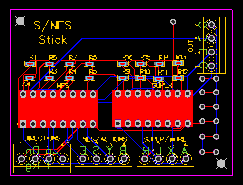

# S-NES-Fight-Stick-PCB
Printed Circuit Board to connect to a Super Nintendo or Nintendo Entertainment console, open pins for 12 digital switches

## Order the PCB

PCB and schematic created with easyEDA, refer to .txt file in "Gerber.zip"
